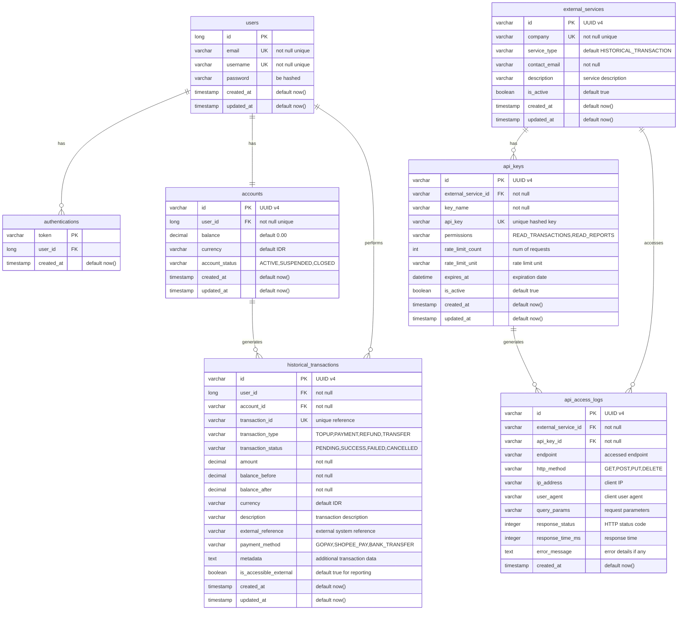

### ERD

```mermaid
erDiagram
    users ||--o{ authentications : has
    users ||--|| accounts : has
    accounts ||--o{ historical_transactions : generates
    users ||--o{ historical_transactions : performs
    external_services ||--o{ api_keys : has
    api_keys ||--o{ api_access_logs : generates
    external_services ||--o{ api_access_logs : accesses

    users {
        long id PK
        varchar email UK "not null unique"
        varchar username UK "not null unique"
        varchar password "be hashed"
        timestamp created_at "default now()"
        timestamp updated_at "default now()"
    }

    authentications {
        varchar token PK
        long user_id FK
        timestamp created_at "default now()"
    }

    accounts {
        varchar id PK "UUID v4"
        long user_id FK "not null unique"
        decimal balance "default 0.00"
        varchar currency "default IDR"
        varchar account_status "ACTIVE,SUSPENDED,CLOSED"
        timestamp created_at "default now()"
        timestamp updated_at "default now()"
    }

    historical_transactions {
        varchar id PK "UUID v4"
        long user_id FK "not null"
        varchar account_id FK "not null"
        varchar transaction_id UK "unique reference"
        varchar transaction_type "TOPUP,PAYMENT,REFUND,TRANSFER"
        varchar transaction_status "PENDING,SUCCESS,FAILED,CANCELLED"
        decimal amount "not null"
        decimal balance_before "not null"
        decimal balance_after "not null"
        varchar currency "default IDR"
        varchar description "transaction description"
        varchar external_reference "external system reference"
        varchar payment_method "GOPAY,SHOPEE_PAY,BANK_TRANSFER"
        text metadata "additional transaction data"
        boolean is_accessible_external "default true for reporting"
        timestamp created_at "default now()"
        timestamp updated_at "default now()"
    }

    external_services {
        varchar id PK "UUID v4"
        varchar company UK "not null unique"
        varchar service_type "default HISTORICAL_TRANSACTION"
        varchar contact_email "not null"
        varchar description "service description"
        boolean is_active "default true"
        timestamp created_at "default now()"
        timestamp updated_at "default now()"
    }

    api_keys {
        varchar id PK "UUID v4"
        varchar external_service_id FK "not null"
        varchar key_name "not null"
        varchar api_key UK "unique hashed key"
        varchar permissions "READ_TRANSACTIONS,READ_REPORTS"
        int rate_limit_count "num of requests"
        varchar rate_limit_unit "rate limit unit"
        datetime expires_at "expiration date"
        boolean is_active "default true"
        timestamp created_at "default now()"
        timestamp updated_at "default now()"
    }

    api_access_logs {
        varchar id PK "UUID v4"
        varchar external_service_id FK "not null"
        varchar api_key_id FK "not null"
        varchar endpoint "accessed endpoint"
        varchar http_method "GET,POST,PUT,DELETE"
        varchar ip_address "client IP"
        varchar user_agent "client user agent"
        varchar query_params "request parameters"
        integer response_status "HTTP status code"
        integer response_time_ms "response time"
        text error_message "error details if any"
        timestamp created_at "default now()"
    }
```